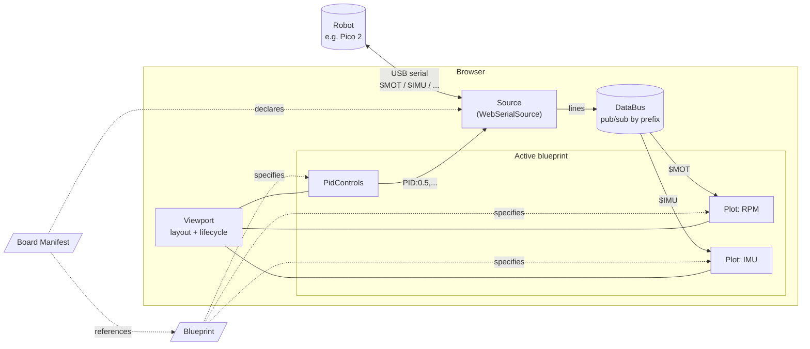
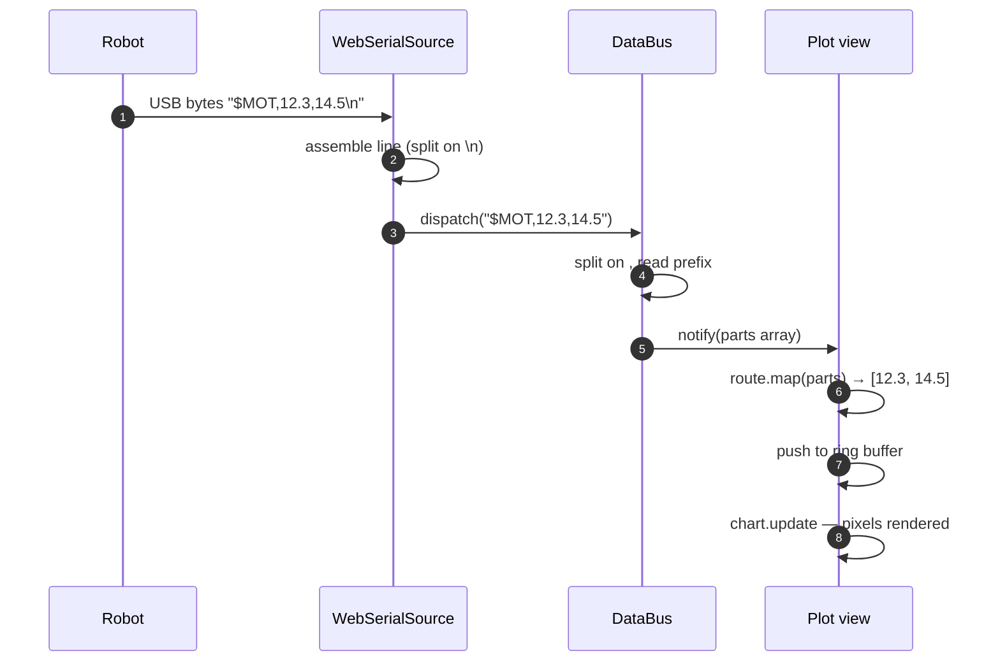
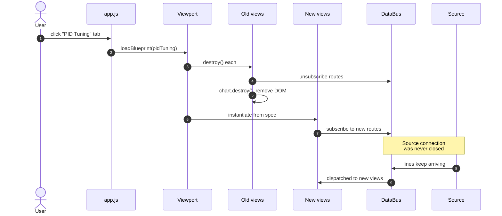

# Architecture

A walkthrough of how this dashboard is put together. Written for makers who want to extend it — you should be able to follow this without being a JavaScript pro. If you've ever wired up an Arduino, soldered a PCB, or read your own multimeter, you're in the target audience.

---

## What this app does

It's a live dashboard that talks to a microcontroller-based robot over USB and shows what's happening in real time: motor speeds, sensor readings, loop timing, and so on. You can pause to analyze, zoom in on a specific moment, send commands back to the robot, and switch between different "pages" (like *Telemetry* vs *PID Tuning*) without ever dropping the connection.

It runs entirely in your browser. No server. No cloud. No install. Just open the HTML file and click Connect.

---

## The big picture

Imagine a kitchen.

- The **drive-thru window** is where orders come in from the customer (the robot). We call this the **Source**.
- The **expediter** at the pass reads each ticket and shouts the order to the right station. That's the **Data Bus**.
- The **stations** — fryer, grill, drinks — each prepare one part of the meal. Those are **Views**.
- The **counter layout** decides which stations are open today and where they sit. That's the **Viewport**.
- A **menu card** says "today we're a burger joint, here's the four stations we need." That's a **Blueprint**.
- The **franchise manual** is the master spec: what menu items exist, what each one's recipe is, what equipment the kitchen has. That's the **Board Manifest**.

Everything in the dashboard is one of those six things. New robot? Same kitchen, different franchise manual. Different page? Same kitchen, different menu card.

---

## Three things to remember

If you only take three ideas away, take these:

1. **Views are tools.** Each view file is one *type* of UI surface — a line chart, a control panel, a gauge, an image viewer. New types = new files in `views/`. Existing views can be reused as many times as a blueprint asks for.
2. **Blueprints are layouts.** They pick which views to show on a page, how each one is configured, and which data routes feed it. New pages = new blueprint files in `boards/<board>/blueprints/`.
3. **Boards are spec sheets.** Each board manifest declares which robot, what protocol it speaks, which blueprints ship with it, and what hardware components to indicate in the topbar. New robots = new folders under `boards/`.

The same three patterns repeat all over: views are reused across blueprints, blueprints are picked by boards, boards swap independently of everything else. Add by appending a file in the right folder.

---

## Visual architecture

### Component overview

How the moving pieces connect at runtime. Solid arrows are runtime data flow; dashed arrows are configuration (read at boot, not active during a session).



### Data flow — single message, byte to pixel

What happens for *one* `$MOT` line from the robot, dozens of times per second:



### User action — switching blueprints

What happens when you click the *PID Tuning* tab. The Source connection is never dropped — data keeps flowing the whole time.



---

## The six pieces

### 1. Source — the bridge to your hardware

A Source connects to a robot and turns its output into clean lines of text the rest of the app understands. The current source is `WebSerialSource`, which speaks USB serial through your browser. If a future board uses WiFi or Bluetooth, you'd write a new source file (`WebSocketSource`, `BleSource`) — and the rest of the app wouldn't change.

What every Source provides:
- `connect()` — open the link / pair with the device
- `disconnect()` — tear it down
- `send("STOP\n")` — push a command back to the robot
- `onLine(callback)` — get notified for every line of incoming text
- `onStatus(callback)` — get notified when connection state changes

That's the whole interface. Anything that implements those is a valid Source.

### 2. Data Bus — the message router

When a line of text arrives from the source, it usually starts with a marker like `$MOT` (motors) or `$IMU` (orientation). The Data Bus is a switchboard: anyone who cares about `$MOT` messages subscribes once, and they get a copy whenever a `$MOT` line shows up. They never need to know where the message came from.

This decouples views from the source. A motor-RPM chart doesn't care whether bytes came from USB, a saved file, or a future BLE source — it just cares about `$MOT`. Switch the source, charts keep working.

### 3. View — one panel of UI

A View is one box on screen: a chart, a control panel, a numeric readout. Two view types exist today:

- **Plot** — a line chart with one or more series. Pause, zoom, hover crosshair, click-to-toggle legend.
- **PidControls** — sliders for kP/kI/kD plus an Apply and a Stop button. Sends commands back through the Source.

A view declares what data it needs (e.g., "I want every `$MOT` line, give me fields 1 and 2"). When mounted, it subscribes to the Data Bus. When the page changes and it's no longer needed, it unsubscribes and cleans up its DOM and any background work.

### 4. Viewport — the dashboard's layout area

The Viewport is the big container in the middle of the screen where Views live. It owns the active set of views and arranges them (currently as a CSS grid). When you switch pages, the Viewport tears down the current views and builds the new ones.

The Viewport also wires cross-view interactions:
- Zoom one chart, all charts zoom together (synced X axis).
- Hover one chart, every chart shows a vertical line at the same time point.

### 5. Blueprint — a saved page layout

A Blueprint is a small file that says "this page has these views, configured this way." Today there are two: **Telemetry** (4 standard plots) and **PID Tuning** (a setpoint plot, an error plot, and the controls panel).

A blueprint is essentially a saved tab. Switching tabs in the topbar swaps the active blueprint, the Viewport rebuilds, and you're looking at a different combination of views. The Source connection stays open the whole time — switching tabs doesn't drop your data.

A blueprint file looks like this (real example, simplified):

```js
registerBlueprint('telemetry', {
  name: 'Telemetry',
  views: [
    {
      type: 'plot',
      title: 'Motor RPM',
      series: [
        { label: 'L', color: '#4cc9f0' },
        { label: 'R', color: '#f72585' },
      ],
      routes: [
        { prefix: '$MOT', map: parts => [parseFloat(parts[1]), parseFloat(parts[2])] },
      ],
    },
    // ... more views
  ],
});
```

The `routes` field is how a view tells the Data Bus what data it wants. "When you see a `$MOT` line, take fields 1 and 2, that's my data."

### 6. Board Manifest — the robot's spec sheet

When you add a new robot to the dashboard, you write a board manifest. It answers:

- What's this board called?
- How do we talk to it? (USB serial at 115200 baud? WebSocket?)
- What messages does it send? (`$MOT`, `$IMU`, `$TOF`, etc., and what each field means.)
- What hardware does it have? (Drives the indicator dots in the topbar.)
- Which blueprints ship with this board?
- What commands does it accept?

The manifest is the **single source of truth** for one board. The dashboard reads it to figure out everything it needs to render. Add a new manifest, the dashboard recognizes a new board.

---

## How data flows through the app (step by step)

1. **You click "Connect"** in the topbar.
2. The **Source** (`WebSerialSource`) opens the browser's port picker; you choose your robot's USB port.
3. **Bytes arrive** from the robot. The Source assembles them into lines (split on newline character).
4. **For each line**, the Source notifies its line-subscribers — the main one is the Data Bus dispatcher.
5. The **Data Bus** parses the line into parts (split on commas), reads the prefix (e.g., `$MOT`), and notifies every subscriber for that prefix.
6. **Each subscribing view's route** extracts the fields it cares about and pushes them into the view's internal buffer.
7. The **view redraws** its chart with the new data. Status pills also update from `$STA` lines.

That round trip happens dozens of times per second, every second the connection's open.

---

## How user actions flow

When you press **spacebar to pause**:
1. App receives the keydown.
2. App calls `viewport.setPaused(true)`.
3. Viewport calls `setPaused(true)` on every view.
4. Each Plot stops redrawing its chart, but its buffer keeps filling. The current values in the chips stay live; only the line drawing freezes.

When you switch to the **PID Tuning** tab:
1. Tab handler calls `loadBlueprint('pid-tuning')`.
2. Viewport unmounts every current view (each view destroys its chart and unsubscribes from the Data Bus).
3. Viewport reads the new blueprint's view list, instantiates each one.
4. Each new view subscribes to the Data Bus for the messages it cares about.
5. The connection never closed. Data has been flowing the whole time. New views start receiving immediately.

---

## Why these choices

Three principles, in priority order:

1. **One source of truth per concept.** The wire protocol lives in the manifest. Page layouts live in blueprints. Visual styling lives in views. When something changes, you know exactly where to edit.
2. **Components don't know about each other.** A view doesn't know what produces its data. The source doesn't know who consumes its lines. Add a new view? Won't break others. Add a new source? Won't break views. Add a new board? Won't break the dashboard core.
3. **Add by appending, not editing.** Adding a board, blueprint, or view type means writing new files. The existing code keeps working untouched.

Following those three turns extending the dashboard from "edit five files in three folders" into "drop in a new folder."

---

## Directory layout

```
robotUI/webgui/
├── index.html         Shell + script load order
├── style.css          Global styles
├── app.js             Top-level wiring (connects buttons to source/viewport)
├── databus.js         Message router (pub/sub by prefix)
├── viewport.js        Layout container + registries
├── sources/           Transports (one file per transport)
│   └── web-serial.js
├── views/             View types (one file per type)
│   ├── plot.js
│   └── pid-controls.js
└── boards/            Boards (one folder per board)
    └── pico/
        ├── manifest.js
        └── blueprints/
            ├── telemetry.js
            └── pid-tuning.js
```

The pattern: anything that's pluggable lives in its own folder, with one file per option.

---

## What's deliberately *not* in the architecture

A few things you'd find in bigger dashboards that we've left out on purpose:

- **No saved layouts.** You can't drag charts around and have it remember. Blueprints are the substitute — pick a tab, get a fixed layout.
- **No history across tab switches.** When you switch from Telemetry to PID Tuning and back, the chart buffers start empty again. Could be fixed by lifting buffers into a shared store, deferred for now.
- **No multiple robots at once.** You can switch which board is active, but you can't view two boards simultaneously.
- **No data download / replay.** Live only. If you want to record, capture the serial console.

Each of these is deliberate scope-management. They have known designs and would be added when there's a concrete use for them.
