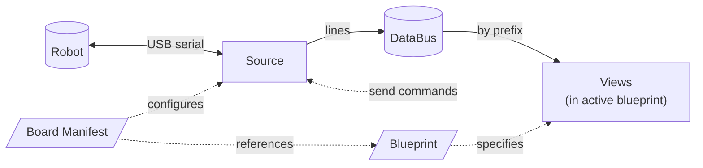

# Robot Dashboard

A live telemetry and control dashboard for microcontroller-based robots, running entirely in your browser. Connects directly to your hardware via USB serial — no server, no cloud, no install. Currently set up for a Raspberry Pi Pico 2 rover but designed to extend to any board that emits line-based telemetry.

For a tour of how the pieces fit together, see [Architecture.md](./Architecture.md).

---

## Quick start

1. Open `index.html` in **Chrome, Edge, or Brave** (Web Serial requires a Chromium-based browser).
2. Plug your robot into the computer via USB.
3. Click **Connect** in the topbar.
4. Pick your robot's port from the picker. Charts come alive.

That's it.

---

## Features

| Action | How |
|---|---|
| Pause / resume | Click ⏸ Pause, or press spacebar |
| Zoom into a chart | Pause first, then scroll wheel over the chart |
| Pan a zoomed chart | Pause first, then click and drag |
| Reset zoom | Double-click any chart, or click ⤢ Reset |
| Hide/show a series | Click the colored chip in the chart header |
| Switch pages | Click a tab in the topbar |
| See raw serial output | Click *Serial Console* in the bottom-left |

When you zoom one chart, every chart on the page zooms in sync. When you hover one chart, every other chart shows a vertical guideline at the same time point.

---

## Browser compatibility

| Browser | Works |
|---|---|
| Chrome | ✅ |
| Edge | ✅ |
| Brave | ✅ |
| Safari | ❌ (no Web Serial API) |
| Firefox | ❌ (no Web Serial API) |

If you can't use Chromium, you can run the dashboard in any browser by serving it over a local HTTP server, but Web Serial still won't work — you'd need a different transport (WebSocket, etc.).

---

## Three things to remember before extending

If you only take three ideas away from the architecture, take these. Everything below builds on them:

1. **Views are tools.** Each view file is one *type* of UI surface — a line chart, a control panel, a gauge, an image viewer. New types = new files in `views/`. Existing views can be reused as many times as a blueprint asks for.
2. **Blueprints are layouts.** They pick which views to show on a page, how each one is configured, and which data routes feed it. New pages = new blueprint files in `boards/<board>/blueprints/`.
3. **Boards are spec sheets.** Each board manifest declares which robot, what protocol it speaks, which blueprints ship with it, and what hardware components to indicate in the topbar. New robots = new folders under `boards/`.

The data path at runtime, in one diagram:



For a deeper walkthrough including data-flow and user-action sequence diagrams, see [Architecture.md](./Architecture.md). The how-to guides below assume you've at least skimmed those three ideas.

## How to add a new chart

The fastest way to extend the dashboard. No new files — just edit a blueprint.

Open `boards/pico/blueprints/telemetry.js` and add an entry to the `views` array:

```js
{
  type: 'plot',
  id: 'battery',
  title: 'Battery Voltage',
  series: [
    { label: 'V', color: '#4ade80' },
  ],
  routes: [
    {
      prefix: '$BAT',                          // message marker to listen for
      map: (parts) => [parseFloat(parts[1])],  // extract V from parts[1]
    },
  ],
},
```

Reload the page. You now have an extra chart.

- **Multiple lines on the same chart?** Add more entries to `series`, then return that many values from `map`.
- **Multiple message types feeding the same chart?** Add more entries to `routes`.
- **Don't want a label prefix on the value chip** (e.g. `Distance: 320` vs just `320 mm`)? Add a `format` function to the series:
  ```js
  { label: 'Distance', color: '#4ade80',
    format: (label, v) => v == null ? '-- mm' : `${v.toFixed(0)} mm` }
  ```

---

## How to add a new tab (blueprint)

A blueprint is a saved page layout. Switching tabs swaps the active blueprint. The connection to the robot stays open across tab switches.

### Step 1: Create a blueprint file

`boards/pico/blueprints/drive-test.js`:

```js
registerBlueprint('drive-test', {
  name: 'Drive Test',
  views: [
    {
      type: 'plot',
      id: 'speed',
      title: 'Wheel Speeds',
      series: [
        { label: 'L', color: '#4cc9f0' },
        { label: 'R', color: '#f72585' },
      ],
      routes: [
        { prefix: '$MOT', map: (p) => [parseFloat(p[1]), parseFloat(p[2])] },
      ],
    },
    // ... more views as needed
  ],
});
```

### Step 2: List it in the board manifest

`boards/pico/manifest.js`:

```js
blueprints: ['telemetry', 'pid-tuning', 'drive-test'],
```

### Step 3: Load the file

Add a script tag in `index.html` after the existing blueprint scripts:

```html
<script src="boards/pico/blueprints/drive-test.js"></script>
```

Reload. New tab in the topbar.

---

## How to add a new board

A new board is a new folder under `boards/`. The dashboard core never changes.

### Step 1: Lay out the folder

```
boards/
└── my-drone/
    ├── manifest.js
    └── blueprints/
        └── flight.js
```

### Step 2: Write the manifest

`boards/my-drone/manifest.js`:

```js
registerBoardManifest({
  id: 'my-drone',
  name: 'My Drone',
  mcu: 'STM32H7',

  source: {
    type: 'web-serial',     // or 'websocket', 'ble', etc.
    baudRate: 921600,
  },

  // What messages does this board send?
  messages: {
    $ATT: { fields: ['roll', 'pitch', 'yaw'] },
    $ALT: { fields: ['altMeters', 'climbRate'] },
    $BAT: { fields: ['voltage', 'current', 'percent'] },
  },

  // What hardware does it have? (drives the topbar indicator dots)
  components: [
    { id: 'imu',     name: 'IMU',     from: { msg: '$ATT', alwaysOn: true } },
    { id: 'baro',    name: 'Baro',    from: { msg: '$ALT', alwaysOn: true } },
    { id: 'battery', name: 'Battery', from: { msg: '$BAT', alwaysOn: true } },
  ],

  // Which blueprints (pages) ship with this board?
  blueprints: ['flight'],

  // Optional: known commands. Useful for future auto-built control panels.
  commands: {
    ARM:    { args: [] },
    DISARM: { args: [] },
  },
});
```

### Step 3: Write at least one blueprint

`boards/my-drone/blueprints/flight.js`:

```js
registerBlueprint('flight', {
  name: 'Flight',
  views: [
    {
      type: 'plot',
      id: 'attitude',
      title: 'Attitude',
      series: [
        { label: 'Roll',  color: '#4cc9f0' },
        { label: 'Pitch', color: '#f72585' },
        { label: 'Yaw',   color: '#f59e0b' },
      ],
      routes: [
        { prefix: '$ATT', map: (p) => [parseFloat(p[1]), parseFloat(p[2]), parseFloat(p[3])] },
      ],
    },
  ],
});
```

### Step 4: Add the script tags

In `index.html`:

```html
<script src="boards/my-drone/manifest.js"></script>
<script src="boards/my-drone/blueprints/flight.js"></script>
```

Reload. The dashboard now boots with My Drone — its own status pills, its own tabs, its own messages.

> **For now**, the active board is the first one registered. To swap between boards, comment out one set of `<script>` tags. A proper board picker is a future addition.

---

## How to add a new view type

If you need something other than a line chart — a control panel, a 3D scene, a numeric readout, an image — write a new view class.

### The interface

```js
class MyView {
  constructor(spec, container, ctx) {
    // spec:      one entry from a blueprint's `views` array
    // container: the DOM element to attach to (call container.appendChild)
    // ctx:       { connection, bus } — the source and the data bus

    // Build your DOM, subscribe to anything you need on the bus.
  }

  destroy() {
    // Unsubscribe from the bus, remove your DOM, free anything you allocated.
  }

  // Optional methods. Implement only what makes sense for your view:
  // setPaused(paused)            when global pause toggles
  // resetZoom({ emit })          when reset is requested
  // setHoverX(x)                 when another view hovers
  // setVisibleRange(min, max)    when another view zooms (X-axis sync)
  // onZoomChanged(callback)      to participate as a zoom *source*
  // onHoverChanged(callback)     to participate as a hover *source*
}

registerViewType('my-view', (spec, container, ctx) => new MyView(spec, container, ctx));
```

Save as `views/my-view.js`, add a script tag in `index.html` (between the existing view scripts and the board scripts), and reference `type: 'my-view'` in any blueprint.

For a complete worked example of a non-Plot view, look at `views/pid-controls.js`.

---

## How to add a new transport (Source)

If your future board uses something other than USB serial — WebSocket, BLE, MQTT — write a new source.

Pattern:

1. Copy `sources/web-serial.js` → `sources/<your-transport>.js`. Rename the class.
2. Replace the connect / read / send guts with your transport. Keep the public methods (`connect`, `disconnect`, `send`, `isConnected`, `lastDataTime`, `onLine`, `onStatus`) with the same signatures.
3. In `sources/web-serial.js`, find the `createSource` factory at the bottom and add a case:
   ```js
   case 'websocket':
     return new WebSocketSource(config);
   ```
4. Now any board manifest with `source: { type: 'websocket', url: '...' }` uses your new source.

---

## File layout

```
robotUI/webgui/
├── index.html         Shell. Script tags here decide what's loaded.
├── style.css          Global styles.
├── app.js             Top-level wiring. Connects buttons to source/viewport.
├── databus.js         Message router (pub/sub by message prefix).
├── viewport.js        Layout container + view/blueprint/board registries.
├── sources/           One file per transport.
│   └── web-serial.js
├── views/             One file per type of UI panel.
│   ├── plot.js
│   └── pid-controls.js
└── boards/            One folder per supported board.
    └── pico/
        ├── manifest.js
        └── blueprints/
            ├── telemetry.js
            └── pid-tuning.js
```

For more on what each piece does and why, see [Architecture.md](./Architecture.md).

---

## Troubleshooting

**Port picker shows nothing.** Make sure the robot is plugged in and not held open by another program (PlatformIO monitor, `screen`, an old browser tab). Close anything that might have grabbed the port.

**Charts are flat / no data.** Open the Serial Console (bottom-left). You should see lines arriving. If the console is empty, the connection is silent — check the baud rate in the manifest (should match the firmware), the USB cable, and that the firmware is actually emitting data.

**Page is blank or scripts fail to load.** Some browsers refuse to load `<script src="...">` from `file://` URLs in subdirectories. Workaround: serve over a local HTTP server.

```bash
cd robotUI/webgui
python3 -m http.server 8000
```

Then open `http://localhost:8000`.

**Tabs don't switch / pause doesn't work.** Open the JavaScript console (Cmd+Opt+J on Mac, F12 elsewhere). Most likely a script failed to load — usually a missing or misnamed file. The console will tell you which.

**Pause-then-zoom and resume shows blank chart.** This was a known bug, fixed in commit `7497290`. If you see it, you're on an old version — pull latest.

**The wheel zooms while I'm not paused.** It shouldn't. Live mode disables wheel/drag/pinch interactions and re-enables them when you hit pause. If they're still active, again — old version, pull latest.

---

## What's next

A few things on the roadmap:

- **Persistent buffers across tab switches.** Today, switching tabs loses chart history. Lifting buffers into a shared data store would fix it.
- **Board picker UI.** Today the active board is the first one registered. A picker would let you switch at runtime.
- **Recording / replay.** Save a session to disk, scrub through it later.
- **Schema validation.** Compare incoming messages against the manifest's schema, warn on drift.

Each of these is additive — the architecture is designed to absorb them without refactoring.
